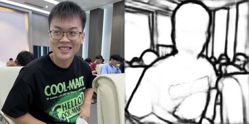

# 🔥PIMoG improved version
> [PIMoG: An Effective Screen-shooting Noise-Layer Simulation for Deep-Learning-Based Watermarking Network](https://dl.acm.org/doi/pdf/10.1145/3503161.3548049)
> 
>MM '22: Proceedings of the 30th ACM International Conference on Multimedia 2022

## 😀 Improved
> Improved code for PIMoG:
> 
> 1️⃣ Visualize loss values
> 
> 2️⃣ Extracted edge mask generation code from BDCN
>  
> 3️⃣ Can input 256x256 network structure
> 
> 4️⃣ More flexible lambda parameters
>  
> 5️⃣ Module for displaying model structure and parameters

## 1. Environment🐵
>Ubuntu20.04\
CUDA 11.7\
python 3.10
```
git clone https://github.com/BarryAlllen/PIMoG-Improved.git

cd PIMoG-Improved

conda create -n pimog python=3.10 -y

conda activate pimog

pip install torch==1.13.1+cu117 torchvision==0.14.1+cu117 torchaudio==0.13.1 --extra-index-url https://download.pytorch.org/whl/cu117

pip install -r requirement.txt
```

## 2. COCO Datasets🐕
### 2.1 Select your data 
If you download the dataset from the [COCO](https://cocodataset.org/#download) official website, you can choose 10000 as the training set and 1000 as the validation set.
```
python /bdcn/select_image.py --num <number> --input <dir> --output <dir>
```
### 2.2 Make your own dataset
😁The code will process this form of data (image with its edgemask):


So you should make your own dataset.(with [BDCN](https://arxiv.org/pdf/1902.10903.pdf))\
Downal the BDCN model can click [here](https://drive.google.com/file/d/1CmDMypSlLM6EAvOt5yjwUQ7O5w-xCm1n/view).\
First, configure the path parameters in `bdcn/edge_mask.py`.(like the input and the output)
```
python /bdcn/edge_mask.py --imgroot <input dir> --imglst <txtname> --model <BDCN model> --results <output dir> --imgsize <size>
```
> 🙃Note: If you don't want to handle it yourself, you can actually download it I've processed.([here]() --waiting)

## 3. Train🐎
* Prepare your dataset
* Set the directory location
* Set the hyper parameters
* Open your Tensoboard (or not)
* Let's go training ! ! !
```
python main.py

or

python main.py --batch_size 32 --num_epoch 100 --image_dir <dir> --image_val_dir <dir>
```

## 4. Embed Watermark🐔
You can set the parameter `is_random` of `prediction.get_msg()` to `False`, which can make the embedded data stable and convenient for verification. Otherwise, you can set it to `True` and randomly set the watermark parameter.
```
python prediction --mode encode --model <dir> --encode_img_path <dir> --encode_result_path <dir>
```

## 5. Extract Watermark from Image🐸
You can choose whether to add noise to the image before extracting the watermark for better data extraction.(set `is_noise` to `True`)
```
python prediction --mode decode --model <dir> --decode_img_path <dir>
```
Then the watermark will be showed in the console.
